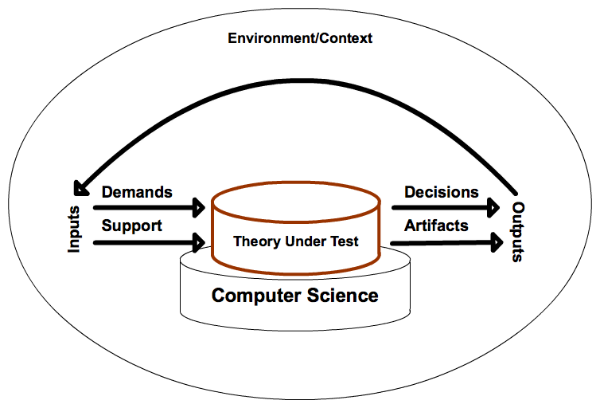

# Software Delivery

What is delivery?
It's a question we'll have to get better at answering before we can think of [[[0b0724e4]]].

- First, we require a language that can describe [[[642f2ca4]]] so that we can share knowledge about the process of delivery.
- Delivery: Acquisition of one+ computational artifacts for use by another.
- Theories are nets cast to catch what we call 'the world': to rationalize, to explain, and to master it. We endeavour to make the mesh ever finer and finer.
- [[[d4cbce56]]]
- [[[3e3c8463]]]
- Delivery directly counters [[[6c41307f]]]
- Delivery requires an [[[310a93f5]]] to deploy _to_ whose implementation is the [[[0a7fefcf]]] you deploy _on_

---

references:

- <https://logosity.net/model.html>
