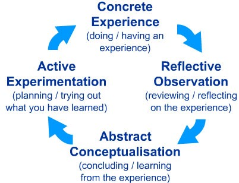

# Kolb's Learning Cycle

Kolb’s approach synthesizes goal-directed and behavior learning theories to create a learning cycle which values process and the ongoing nature of learning.
Kolb’s model highlights the importance of the reflection component in the learning cycle.

1. Concrete Experience - a new experience or situation is encountered, or a reinterpretation of existing experience.
2. Reflective Observation of the New Experience - of particular importance are any inconsistencies between experience and understanding.
3. Abstract Conceptualization reflection gives rise to a new idea, or a modification of an existing abstract concept (the person has learned from their experience).
4. Active Experimentation - the learner applies their idea(s) to the world around them to see what happens.

- <https://www.pugetsound.edu/academics/experiential/create-experiential-learning-opportunities/available-resources/creating-critical-reflection-assignments/design-models/kolbs-learning-cycle/>
- <https://www.simplypsychology.org/learning-kolb.html>
